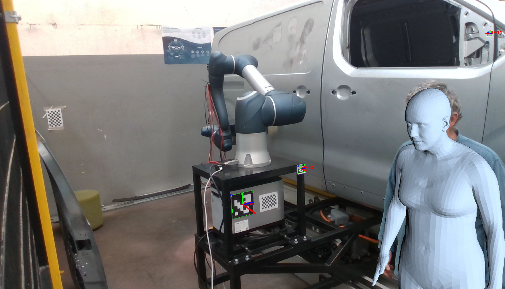
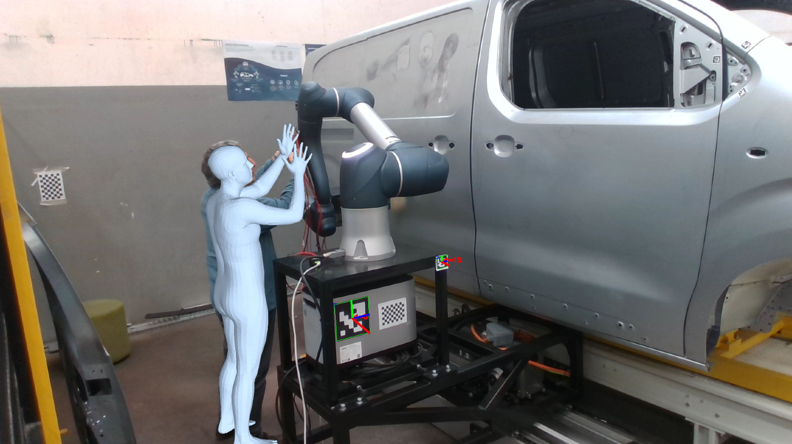
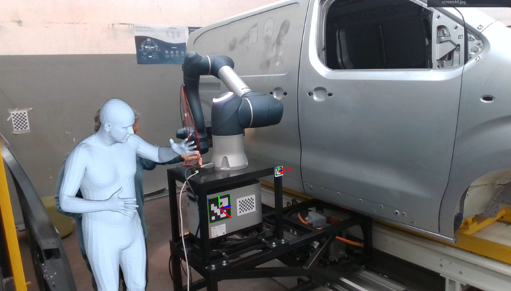
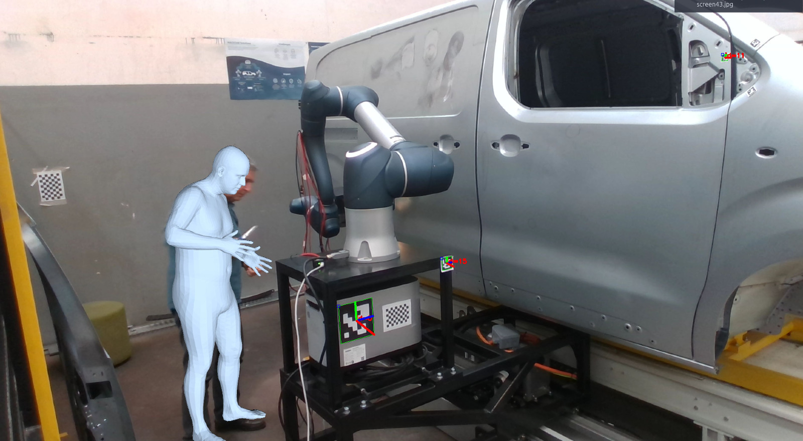
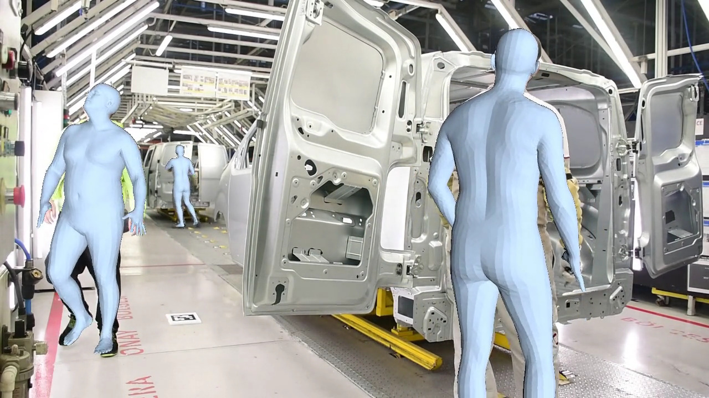
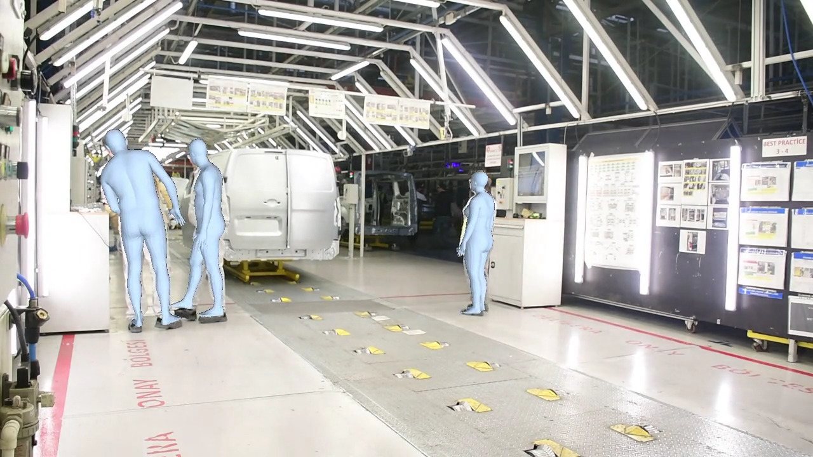
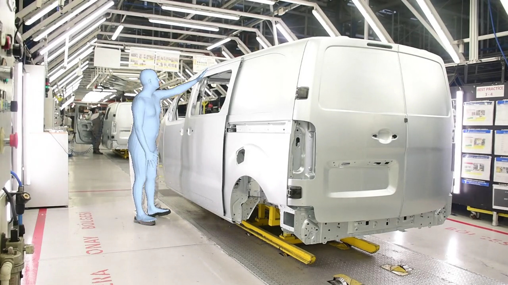

# Magician Body Pose Estimation

A ROS2 package for real-time 3D human body pose estimation using [D-PoSE](https://github.com/AmmarkoV/D-PoSE). It captures frames from a webcam, detects and tracks people with YOLO + SORT, runs the D-PoSE model to estimate 3D skeleton pose, and publishes the results as ROS2 messages and TF transforms.

## Visual Examples

| | |
|---|---|
|  |  |
|  |  |

## Requirements

- ROS2 Humble (or later)
- CUDA-capable GPU
- Python 3.8+
- A webcam or USB camera

## Setup

Clone this package into your ROS2 workspace and run the setup script to fetch D-PoSE and create a virtual environment:

```bash
bash setup.sh
```

This script:
1. Clones the `webcam` branch of D-PoSE into `./D-PoSE/`
2. Creates a Python virtual environment at `D-PoSE/venv/`
3. Installs all Python dependencies including ROS compatibility packages

Then build the ROS2 package:

```bash
cd <your_ros2_ws>
colcon build --packages-select magician_body_pose_estimation
```

## Running

Activate the environment and source ROS2 before running:

```bash
source /opt/ros/humble/setup.bash
source D-PoSE/venv/bin/activate
source install/setup.bash
```

Then run the node directly:

```bash
python3 magician_body_pose_estimation.py
```

Or use the launch script from the workspace root (configured for the Pilot PC with `/dev/video4`):

```bash
bash src/magician_body_pose_estimation/scripts/runROSBodyPoseEstimation.sh
```

## Command-Line Arguments

| Argument | Default | Description |
|---|---|---|
| `--input` | `/dev/video0` | Camera device or video file path (`webcam`, `/dev/videoN`, or file path) |
| `--width` | `1920` | Camera capture width in pixels |
| `--height` | `1080` | Camera capture height in pixels |
| `--fps` | `15` | Camera capture frame rate |
| `--render` | off | Render the 3D mesh overlay in the OpenCV window |
| `--display` | off | Show real-time video window (press `q` to quit) |
| `--use-aruco` | off | Enable ArUco marker detection for camera-to-world calibration |
| `--insist-camera` | off | Retry camera initialization indefinitely (3 s between attempts) |
| `--detection-threshold` | `0.7` | Person detection confidence threshold (0.0–1.0) |
| `--detector` | `yolo` | Object detector (`yolo` or `maskrcnn`) |
| `--yolo-img-size` | `256` | YOLO input image size |
| `--cfg` | `D-PoSE/configs/dpose_conf.yaml` | D-PoSE model config file |
| `--ckpt` | `D-PoSE/data/ckpt/paper_arxiv.ckpt` | D-PoSE model checkpoint |
| `--output-folder` | `./logs` | Directory for log files |

Example with common options:

```bash
python3 magician_body_pose_estimation.py \
    --input /dev/video0 \
    --render \
    --use-aruco \
    --insist-camera \
    --detection-threshold 0.5
```

## Exporting Pose Data to CSV

To process a video file and export all detected 3D skeletons to a CSV, use the provided script:

```bash
bash scripts/bodyPoseEstimationToCSV.sh /path/to/video.mp4
```

This runs D-PoSE's `demo_webcam_csv.py` on the video and writes the output to `<video>_3DBody.csv` alongside the source file. For example:

```
GX010036_out.mp4  →  GX010036_out.mp4_3DBody.csv
```

The CSV contains one row per skeleton per frame, with columns `frame_id`, `skeleton_id`, and an `x/y/z` triplet for every joint (body, hands, and face landmarks). The script handles the venv activation automatically — no manual setup needed.

### Examples

| | | |
|---|---|---|
|  |  |  |

## ROS2 Interface

### Published Topics

| Topic | Type | Description |
|---|---|---|
| `/humans` | `magician_body_pose_estimation/Skeletons` | All detected and tracked skeletons |

### TF Frames

The node publishes a TF transform from `Camera` → `human_<id>` for each tracked person. The orientation is derived from the pelvis, hips, and neck joints.

When `--use-aruco` is active, additional transforms are published: `wood_panel` → `Aruco_marker` → `Camera`.

### Custom Messages

**`Joint3D`** — a single 3D joint position:
```
float64 x
float64 y
float64 z
```

**`Skeleton`** — one tracked person:
```
Joint3D[] joints   # 22 joints in D-PoSE body model order
uint32   id        # Unique tracking ID (persistent across frames)
```

**`Skeletons`** — all people in the scene:
```
Skeleton[] humans
```

## Package Structure

```
magician_body_pose_estimation/
├── magician_body_pose_estimation.py   # Main ROS2 node
├── setup.sh                           # Environment setup (clones D-PoSE, creates venv)
├── scripts/
│   ├── runROSBodyPoseEstimation.sh    # Launch script for the workspace
│   └── bodyPoseEstimationToCSV.sh     # Export video → _3DBody.csv
├── msg/
│   ├── Joint3D.msg
│   ├── Skeleton.msg
│   └── Skeletons.msg
├── doc/                               # Example screenshots
└── package.xml
```

## License

MIT — see `package.xml` for maintainer details.
